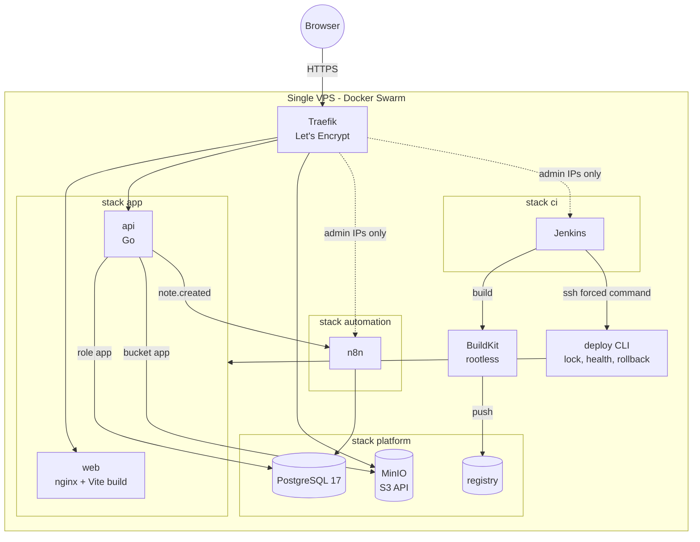

# go-vite-swarm-starter

**Digital foundation:** your application running on infrastructure you own,
versioned in Git, without depending on an expensive PaaS.

A Go API and a Vite frontend deployed to a single VPS with Docker Swarm:

- **Complete setup:** one bootstrap script and three commands take a fresh
  VPS to a running platform
- **Automated deploy per project:** Jenkins tests, builds and deploys each
  system; health checks and automatic rollback
- **Automatic HTTPS** on every domain (Let's Encrypt)
- **Secrets isolated per system:** generated on the server, delivered as
  Docker Secrets, one database and one bucket per system
- PostgreSQL, S3-compatible object storage and n8n included

## Architecture



The example system is a small notes app: notes in PostgreSQL, file attachments
uploaded straight from the browser to object storage with presigned URLs, and
an event sent to an n8n workflow when a note is created.

### Included

| Area | What you get |
| --- | --- |
| Backend | Go 1.25 `net/http`, pgx, embedded migrations, presigned uploads, structured logs, health/readiness, distroless non-root image |
| Frontend | Vite + React + TypeScript, unprivileged nginx image |
| Platform | Traefik v3 (HTTP→HTTPS, security headers, admin IP allowlist), PostgreSQL 17, MinIO, private registry, n8n |
| Deploy | [`deploy`](deploy/bin/deploy) CLI: global lock, validation, convergence wait, rollback, audit history |
| CI/CD | Jenkins as code, rootless BuildKit, [`Jenkinsfile`](Jenkinsfile), SSH deploy restricted by a forced command |
| Host | [`bootstrap.sh`](deploy/host/bootstrap.sh): Docker, Swarm, deploy user, firewall (UFW + DOCKER-USER), with `--dry-run` |
| Quality | GitHub Actions: tests, linters, shellcheck, hadolint, gitleaks; images and actions pinned by digest |

### Not included

High availability (it is one node), backups of volumes (use your provider's
snapshots plus a copy of `/etc/starter/secrets`), metrics and alerting, SSO,
staging environments. The
[vps-gitops-harness](https://github.com/mare-analitica/vps-gitops-harness)
covers operating a larger platform with those concerns.

> **Object storage:** the MinIO community edition no longer receives updates.
> Read [docs/object-storage.md](docs/object-storage.md) before storing anything
> important.

## Local development

Requirements: Docker with Compose, Go 1.25+, Node 22, `make`.

```bash
make dev    # PostgreSQL, MinIO, n8n and the API on http://localhost:8080
make web    # frontend on http://localhost:5173
```

| Service | URL | Notes |
| --- | --- | --- |
| Frontend | <http://localhost:5173> | Vite dev server, proxies `/api` |
| API | <http://localhost:8080/readyz> | Rebuilt by `make dev` |
| MinIO console | <http://localhost:9001> | `dev-minio-root` / `dev-minio-root-password` |
| n8n | <http://localhost:5678> | Workflow "Starter: note created" imported and active |

All credentials in `compose.dev.yaml` are **development-only and public**.
`make down` stops the environment; `make clean` also deletes its data.
`make test` and `make lint` run the main checks locally.

## Deploying to a VPS

```bash
git clone https://github.com/<your-org>/<your-repo>.git /opt/starter && cd /opt/starter
deploy/host/bootstrap.sh --ssh-from <your-ip>/32
# edit /etc/starter/config.env: domains, e-mail, admin IPs, repository
deploy stack platform && deploy stack automation && deploy stack ci
# open Jenkins, run the "app" job
```

Step by step: **[docs/vps-quickstart.md](docs/vps-quickstart.md)**.

| Guide | Covers |
| --- | --- |
| [VPS quickstart](docs/vps-quickstart.md) | DNS, bootstrap, configuration, first pipeline run, undoing each step |
| [Deploy and rollback](docs/deploy-and-rollback.md) | What `deploy` checks, rolling back, reading failures |
| [Secrets model](docs/secrets.md) | Where secrets live, isolation per system, rotation |
| [CI/CD](docs/ci.md) | Pipeline, security boundaries, changing Jenkins |
| [Adding an app](docs/adding-an-app.md) | A second system with its own stack, database, bucket and job |
| [Object storage](docs/object-storage.md) | MinIO status and S3 alternatives |

## Repository layout

```text
backend/            Go API (cmd/api, internal/...)
frontend/           Vite + React app
dev/                local development fixtures (database init, n8n workflow)
deploy/
  bin/              deploy CLI and SSH forced command
  config/           example host configuration
  host/             bootstrap.sh
  hooks/            per-stack secrets, databases and buckets
  jenkins/          Jenkins image and configuration as code
  lib/              helpers used by hooks
  n8n/              n8n entrypoint
  stacks/           platform, automation, ci, app
docs/               guides
Jenkinsfile         pipeline of the example system
```

## Contributing and security

See [CONTRIBUTING.md](CONTRIBUTING.md). Report vulnerabilities privately as
described in [SECURITY.md](SECURITY.md).

## License

Copyright 2026 Paulo. Licensed under the [Apache License 2.0](LICENSE);
see [NOTICE](NOTICE).
