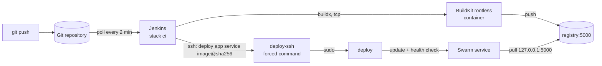

# CI/CD with Jenkins

## Security boundaries

- **No Docker API in Jenkins.** It has only the Docker CLI as a client of the
  rootless BuildKit container. A malicious build step cannot start containers,
  mount the host disk or change services.
- **Deploy key with a forced command.** The key in Jenkins
  (`ci_deploy_ssh_key`) can only run `status`, `history` and
  `app <service> <image@sha256>` (`deploy/bin/deploy-ssh`), only from the
  Docker gateway network, with no TTY or forwarding. `sudo` for `deployer` is
  limited to those commands and `deploy` validates them again.
- **Host key verified.** `ci_deploy_known_hosts` is generated from the host's
  own key by the bootstrap, so Jenkins never trusts on first use.
- **Everything as code.** [`casc/jenkins.yaml`](../deploy/jenkins/casc/jenkins.yaml)
  (security, credentials) and [`casc/jobs.yaml`](../deploy/jenkins/casc/jobs.yaml)
  (jobs) are applied on every start; UI changes are overwritten.

## The pipeline

[`Jenkinsfile`](../Jenkinsfile) at the repository root:

| Stage | Does |
| --- | --- |
| Test | `docker buildx build --target test` for `backend` (go vet, go test) and `frontend` (lint), in parallel |
| Build & push | builds both images, tags them with the commit, pushes to `registry:5000`, reads the digests |
| Deploy | `deploy app app_api …` then `deploy app app_web …` over SSH; API first so the frontend never ships ahead of a failed API |

The job deploys the branch in `GIT_BRANCH`. Pull requests are validated by
GitHub Actions (`.github/workflows/ci.yml`), not by Jenkins.

## Changing Jenkins

| Change | How |
| --- | --- |
| Plugins, Jenkins version | [`deploy/jenkins/`](../deploy/jenkins) → commit → `deploy stack ci` (image rebuilt when the directory hash changes) |
| Security, credentials | `casc/jenkins.yaml` → commit → `deploy stack ci` |
| New job | `casc/jobs.yaml` → commit → `deploy stack ci` ([adding an app](adding-an-app.md)) |
| Admin password | edit `/etc/starter/secrets/jenkins_admin_password`, bump its `.version`, `deploy stack ci` |

## More users

The starter has one local `admin` and lets any logged-in user do anything. For
a team, add the `matrix-auth` plugin and grant permissions per user or group in
`casc/jenkins.yaml`, or connect an identity provider (OIDC). The
[vps-gitops-harness](https://github.com/mare-analitica/vps-gitops-harness)
documents a Keycloak setup with groups and 2FA.
